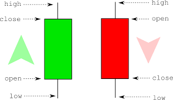

# ✨ Unlock the World of Stocks: Your Essential Beginner's Guide ✨

Welcome to your first steps in understanding stock trading! This guide is designed to introduce you to the fundamental concepts, lingo, and crucial tools you'll need to start navigating the stock market. Let's build your foundation!

---

## 📈 Section 1: Stock Trading 101 - The Basics

Stock trading is your opportunity to become a part-owner of exciting companies and potentially grow your wealth. It involves buying and selling pieces of companies – called shares – on organized marketplaces known as stock exchanges.

### 🔑 The Building Blocks: Key Concepts

Understanding these core ideas is crucial before you make your first trade.

*   **`Stock` (or Share):** 🏢 Represents a unit of **ownership** in a company. Buying a stock makes you a part-owner!
*   **`Trading`:** 🤝 The act of **buying and selling** financial instruments like stocks, aiming to profit from price changes.
*   **`Stock Exchange`:** 🌐 The **marketplace** (like NYSE or Nasdaq) where buyers and sellers connect to trade stocks.
*   **`Brokerage Account`:** 💼 Your required **account** with a licensed firm to access the stock exchange and place trades.
*   **`Market Price`:** 💲 The **current live price** at which a stock can be bought or sold. It fluctuates constantly during trading hours!
*   **`Bid Price`:** 💰 The **highest price** a buyer is currently willing to pay for a stock.
*   **`Ask Price` (or Offer Price):** 🛒 The **lowest price** a seller is currently willing to accept for a stock.
*   **`Spread`:** ↔️ The **difference** between the Bid and Ask prices.

### 🛒 How to Place Your Order: Basic Order Types

This determines how your trade is executed on the exchange. Choosing the right one is important!

| Feature           | Market Order                     | Limit Order (Buy)                      | Limit Order (Sell)                     |
| :---------------- | :------------------------------- | :------------------------------------- | :------------------------------------- |
| **Price Guarantee** | **None.** Executes at best available current price. | **Guaranteed price (or better).** Executes only at your limit price or *lower*. | **Guaranteed price (or better).** Executes only at your limit price or *higher*. |
| **Execution Speed** | **Fast.** Prioritizes immediate execution. | **Slower/Uncertain.** May not execute if price doesn't reach your limit. | **Slower/Uncertain.** May not execute if price doesn't reach your limit. |
| **Best Use Case** | When you need to trade **immediately** and price isn't a major concern (e.g., high volume, stable stocks). | When you want to buy at a **specific lower price** than the current market price. | When you want to sell at a **specific higher price** than the current market price. |

---

## 📊 Section 2: Your Analytical Toolkit - Key Metrics & Indicators

Making smart decisions requires looking beyond just the price. These metrics and indicators are your compass for understanding both the company itself and its price behavior!

### 🏢 Understanding the Company: Fundamental Metrics

These metrics help you evaluate the financial health and underlying performance of a business.

*   **`EBITDA` (Earnings Before Interest, Taxes, Depreciation, and Amortization):** 💼📈
    > **What it is:** A core measure of a company's **operational profitability**. It shows how much profit the company makes purely from its core business activities before accounting for financing costs (interest), government claims (taxes), and non-cash expenses (depreciation/amortization).
    >
    > **Why it's important:** Provides a clearer view of a company's operating performance and cash flow potential, especially useful when comparing companies with different debt levels or asset structures.
    >
    > **Think of it as:** The 'raw' profit from running the business, before external factors and accounting methods are applied.

### 💹 Reading the Price Action: Market Data Metrics

These are the essential data points that summarize a stock's trading activity over a specific time period (like a day or an hour). They form the basis of stock charts!

| Term       | Description                                                    | Visual Hint (on a Chart)                                                                 |
| :--------- | :------------------------------------------------------------- | :--------------------------------------------------------------------------------------- |
| **`Open`** | The price at which the stock **first traded** during the period. | Often the top or bottom of the main "body" of a candlestick or bar for the period.        |
| **`High`** | The **highest price** reached during the period.               | The very top point of the "wick" or "shadow" extending from the candlestick/bar.         |
| **`Low`**  | The **lowest price** reached during the period.                | The very bottom point of the "wick" or "shadow" extending from the candlestick/bar.      |
| **`Close`**| The price at which the stock **last traded** during the period.  | Often the other end of the main "body" of the candlestick or bar (opposite the Open).    |
| **`Volume`**| The **total number of shares traded** during the period.         | Usually shown as a bar graph below the price chart, indicating trading activity strength. |

### 🛠️ Spotting Trends & Momentum: Technical Indicators

Mathematical tools based on price and volume data, used by traders to identify patterns, trend strength, and potential future price movements.

*   **`MACD` (Moving Average Convergence Divergence):** 🎢
    > **What it is:** A trend-following momentum indicator composed of three parts: the **MACD line** (difference between two exponential moving averages), the **Signal line** (an average of the MACD line), and the **Histogram** (shows the distance between the MACD and Signal lines).
    >
    > **Why it's important:** Helps identify potential trend changes, momentum shifts, and generates buy/sell signals based on crossovers between the lines and divergences with price.
    >
    > **Think of it as:** A way to see how fast two different averages are moving apart or towards each other, signaling momentum shifts. *(Imagine two wavy lines on your chart below the price, crossing each other!)*

*   **`RSI` (Relative Strength Index):** 💪
    > **What it is:** A momentum oscillator that measures the speed and magnitude of recent price changes to evaluate overbought or oversold conditions. It oscillates between **0 and 100**.
    >
    > **Why it's important:** Traders use it to spot potential reversals. An RSI typically **above 70** suggests the stock might be **overbought** (potentially due for a price drop), while an RSI typically **below 30** suggests it might be **oversold** (potentially due for a price bounce).
    >
    > **Think of it as:** A meter showing how "strong" the recent price moves have been in one direction, indicating if the price might be stretched too far. *(Imagine a single wavy line on a separate panel, bouncing between 0 and 100!)*

---

> ### ⚠️ Disclaimer
> This guide is designed for educational purposes only and is **not** financial advice. The stock market involves significant risk, and you could lose capital. Always conduct thorough research, understand the risks involved, or consult with a qualified financial advisor before making any investment decisions.

---

Keep learning, stay curious, and trade wisely! Good luck on your trading journey! 🚀