# 🗃️ Supabase Database Migrations

This guide walks you through the process of syncing database changes from your cloud-hosted Supabase instance to your local development environment using migrations.

---

## 🌊 Migration Workflow Overview

The typical workflow for Supabase migrations involves making changes in your cloud database first, then pulling those changes locally to create migration files. This ensures your local development environment stays in sync with production.

```mermaid
graph LR
    A[☁️ Cloud Supabase] --> B[🔗 Link Project]
    B --> C[📥 Pull Changes]
    C --> D[📝 Generate Types]
    D --> E[🏠 Local Database]
```



---

## 🛠️ Step-by-Step Migration Process

### 1️⃣ Make Changes in Cloud Supabase

First, make your database changes directly in your cloud-hosted Supabase instance:

- Create/modify tables through the Supabase Dashboard
- Add columns, indexes, or constraints
- Set up Row Level Security (RLS) policies
- Create functions or triggers

<Tip>
Making changes in the cloud first ensures that your production database structure is the source of truth for your local environment.
</Tip>

### 2️⃣ Link Your Local Project

Connect your local project to the cloud Supabase instance:

```bash
bun sb:link
```

**What this does:**
- Establishes a connection between your local Supabase CLI and your cloud project
- Authenticates your local environment with your Supabase organization
- Sets up the project reference for subsequent operations

<Note>
You'll need to provide your project reference ID and authenticate with your Supabase account when running this command for the first time.
</Note>

### 3️⃣ Pull Database Schema Changes

Sync the cloud database changes to your local environment:

```bash
bun sb:pull
```

**What this does:**
- Compares your cloud database schema with your local schema
- Generates new migration files in the `supabase/migrations/` directory
- Creates SQL files that represent the differences between cloud and local
- Ensures your local database can be updated to match the cloud structure

The generated migration files will have timestamps and descriptive names, for example:
- `20250120123456_add_user_preferences_table.sql`
- `20250120123457_update_portfolios_constraints.sql`

### 4️⃣ Regenerate TypeScript Types

Update your TypeScript definitions to match the new database schema:

```bash
bun sb:typegen
```

**What this does:**
- Connects to your local Supabase instance
- Analyzes the current database schema (including your new migrations)
- Generates TypeScript type definitions for all tables, views, and functions
- Outputs the types to `database.types.ts` in your project root
- Automatically formats the generated file using Biome

<Warning>
Always run `bun sb:typegen` after pulling new migrations to ensure your TypeScript types are accurate and up-to-date.
</Warning>

---

## 🔄 Complete Migration Command Sequence

Here's the complete sequence you'll typically run:

```bash
# 1. Link to your cloud project (one-time setup)
bun sb:link

# 2. Pull the latest schema changes from cloud
bun sb:pull

# 3. Regenerate TypeScript types
bun sb:typegen
```

---

## 📁 Understanding Migration Files

After running `bun sb:pull`, you'll find new files in your `supabase/migrations/` directory:

```
supabase/
├── migrations/
│   ├── 20250519135805_create_portfolios_table.sql
│   ├── 20250519161759_remote_schema.sql
│   ├── 20250520060351_remote_schema.sql
│   └── 20250120123456_your_new_migration.sql  ← New migration
└── config.toml
```

Each migration file contains:
- **Timestamp**: When the migration was created
- **Description**: Brief description of the changes
- **SQL Commands**: The actual database changes to apply

---

## 🎯 Best Practices

### ✅ Do's

- **Always pull before making local changes** to avoid conflicts
- **Review migration files** before applying them to understand what's changing
- **Commit migration files** to version control along with your code changes
- **Test migrations** in a staging environment before production

### ❌ Don'ts

- **Don't edit migration files manually** after they're generated
- **Don't skip type generation** - it ensures type safety across your application
- **Don't make direct local database changes** without corresponding cloud changes

---

## 🚨 Troubleshooting

### Authentication Issues

If `bun sb:link` fails with authentication errors:

```bash
# Re-authenticate with Supabase
bun supabase login
bun sb:link
```

### Migration Conflicts

If you encounter migration conflicts:

```bash
# Reset your local database to match cloud
bun sb:reset
```

<Warning>
`bun sb:reset` will completely reset your local database. Make sure you don't have important local-only data before running this command.
</Warning>

### Type Generation Failures

If `bun sb:typegen` fails:

```bash
# Ensure your local Supabase is running
bun sb:start

# Then retry type generation
bun sb:typegen
```

---

## 🔗 Related Commands

For reference, here are other useful Supabase commands available in the project:

| Command | Description |
|---------|-------------|
| `bun sb:start` | Start local Supabase instance |
| `bun sb:stop` | Stop local Supabase instance |
| `bun sb:push` | Push local migrations to cloud |
| `bun sb:reset` | Reset local database and regenerate types |
| `bun sb:diff` | Create a new migration from schema differences |

---

<Note>
This migration workflow ensures that your local development environment always reflects the current state of your production database, making it easier to develop and test features with confidence.
</Note> 