  <Icon icon="clock" size={16} />
  15 min read
  •
  Last updated: January 2025

<Frame>
  
  
</Frame>

<Card title="What You'll Master" icon="target" color="#6b7280">
  **Complete Investment Education**: Learn everything from basic stock concepts to advanced portfolio management, technical analysis, risk assessment, and market psychology. This guide transforms absolute beginners into informed investors.
</Card>

## What Is Stock Market Investing? A Complete Foundation

Stock market investing is the process of buying shares (partial ownership) in publicly traded companies with the expectation that their value will increase over time. When you buy a stock, you become a shareholder and own a tiny piece of that business, entitled to a proportional share of its profits and assets.

### Why Companies Issue Stock

Companies sell shares to the public to raise capital for growth, expansion, research and development, or debt reduction. Instead of taking loans that require interest payments, companies can sell ownership stakes to investors who provide funding in exchange for potential future profits.

### How Stock Prices Are Determined

Stock prices are determined by supply and demand in the marketplace, influenced by:

**Company Fundamentals**: Revenue growth, profitability, debt levels, competitive position, and management quality.

**Market Sentiment**: Investor emotions, news coverage, analyst recommendations, and overall economic outlook.

**Economic Factors**: Interest rates, inflation, unemployment, GDP growth, and government policies.

**Industry Trends**: Sector-specific developments, technological disruptions, and regulatory changes.

### Types of Investment Returns

**Capital Appreciation**: The increase in stock price from when you buy to when you sell. If you buy at $50 and sell at $75, you've earned $25 per share.

**Dividends**: Regular cash payments some companies make to shareholders, typically quarterly. A 3% dividend yield means you receive $3 annually for every $100 invested.

**Compound Growth**: The exponential growth that occurs when your investment returns generate their own returns over time.

## Understanding Different Market Structures

### Primary vs. Secondary Markets

**Primary Market**: Where companies first sell new shares to the public through Initial Public Offerings (IPOs). You're buying directly from the company.

**Secondary Market**: Where existing shares are traded between investors. This is what most people think of as "the stock market" - NYSE, NASDAQ, etc.

### Market Participants and Their Roles

**Retail Investors**: Individual investors like you and me, typically investing personal savings for long-term goals.

**Institutional Investors**: Large organizations like pension funds, mutual funds, and insurance companies that manage billions of dollars.

**Market Makers**: Firms that provide liquidity by continuously buying and selling stocks, ensuring there's always someone to trade with.

**Algorithmic Traders**: Computer programs that execute trades based on mathematical models and market patterns.

## Global Market Overview and Opportunities

Understanding global financial markets is crucial for modern investors. Each market offers unique opportunities, risks, and characteristics that can enhance your investment portfolio through diversification.

  

    

      

        US
      

      <h3 className="text-xl font-bold text-slate-200">US Markets (NYSE, NASDAQ)</h3>
    

    

      

        Total Market Cap
        $45+ Trillion
      

      

        Daily Volume
        $200+ Billion
      

      

        Listed Companies
        7,000+
      

    

    

      
<strong>Advantages:</strong> Highest liquidity, strong regulations, global companies

      
<strong>Access:</strong> Available to international investors through most brokers

    

  

  

    

      

        VN
      

      <h3 className="text-xl font-bold text-slate-200">Vietnam Markets (HOSE, HNX)</h3>
    

    

      

        Total Market Cap
        $200+ Billion
      

      

        Daily Volume
        $500+ Million
      

      

        Listed Companies
        1,500+
      

    

    

      
<strong>Advantages:</strong> Emerging market growth, lower valuations, local opportunities

      
<strong>Access:</strong> Requires local broker or international platforms with VN access

    

  

### Why Market Diversification Matters

**Geographic Diversification**: Different countries' economies don't always move in sync. When US markets decline, emerging markets might outperform, and vice versa.

**Currency Exposure**: International investments provide exposure to different currencies, which can serve as a hedge against domestic currency weakness.

**Growth Opportunities**: Emerging markets like Vietnam often offer higher growth potential as their economies develop and modernize.

**Valuation Differences**: Markets trade at different valuations, allowing you to find better values in less popular regions.

## Investment Account Types: Choosing the Right Foundation

The type of account you choose significantly impacts your investment returns through tax implications and contribution limits.

### Tax-Advantaged Accounts (US)

**401(k) - Employer-Sponsored Retirement**
- **2025 Contribution Limit**: $23,500 ($31,000 if 50+)
- **Tax Treatment**: Traditional (pre-tax contributions, taxed in retirement) or Roth (after-tax contributions, tax-free withdrawals)
- **Employer Match**: Free money - always contribute enough to get the full match
- **Withdrawal Rules**: Penalties for early withdrawal before age 59½

**IRA (Individual Retirement Account)**
- **2025 Contribution Limit**: $7,000 ($8,000 if 50+)
- **Traditional IRA**: Tax-deductible contributions, taxed withdrawals in retirement
- **Roth IRA**: After-tax contributions, tax-free growth and withdrawals
- **Income Limits**: High earners may not qualify for full Roth IRA contributions

**HSA (Health Savings Account)**
- **Triple Tax Advantage**: Deductible contributions, tax-free growth, tax-free withdrawals for medical expenses
- **2025 Limits**: $4,300 individual, $8,550 family
- **Investment Option**: After building cash balance, can invest in stocks/bonds
- **Retirement Use**: Functions like traditional IRA after age 65 for non-medical expenses

### Taxable Investment Accounts

**Brokerage Accounts**
- **No Contribution Limits**: Invest as much as you want
- **Tax Implications**: Pay taxes on dividends annually and capital gains when you sell
- **Liquidity**: Access your money anytime without penalties
- **Tax-Loss Harvesting**: Can offset gains with losses to reduce taxes

### Account Selection Strategy

1. **Emergency Fund**: High-yield savings account (3-6 months expenses)
2. **Employer 401(k)**: Contribute enough to get full match
3. **High-Interest Debt**: Pay off credit cards and high-rate loans
4. **Roth IRA**: Max out if eligible ($7,000/year)
5. **Max 401(k)**: Increase to contribution limit if possible
6. **Taxable Account**: For additional investments and shorter-term goals

### Why Market Diversification Matters

**Geographic Diversification**: Different countries' economies don't always move in sync. When US markets decline, emerging markets might outperform, and vice versa.

**Currency Exposure**: International investments provide exposure to different currencies, which can serve as a hedge against domestic currency weakness.

**Growth Opportunities**: Emerging markets like Vietnam often offer higher growth potential as their economies develop and modernize.

**Valuation Differences**: Markets trade at different valuations, allowing you to find better values in less popular regions.

## Historical Returns Analysis

  

    <table className="w-full">
      <thead>
        <tr className="border-b border-slate-200 dark:border-slate-700">
          <th className="text-left p-4 font-semibold text-slate-300">Asset Class</th>
          <th className="text-center p-4 font-semibold text-slate-300">1-Year</th>
          <th className="text-center p-4 font-semibold text-slate-300">5-Year</th>
          <th className="text-center p-4 font-semibold text-slate-300">10-Year</th>
          <th className="text-center p-4 font-semibold text-slate-300">20-Year</th>
        </tr>
      </thead>
      <tbody>
        <tr className="border-b border-slate-100 dark:border-slate-800 hover:bg-slate-50 dark:hover:bg-slate-800/50">
          <td className="p-4 font-medium text-gray-600 dark:text-gray-400">S&P 500</td>
          <td className="text-center p-4 text-gray-600 dark:text-gray-400 font-semibold">12.3%</td>
          <td className="text-center p-4 text-gray-600 dark:text-gray-400 font-semibold">10.1%</td>
          <td className="text-center p-4 text-gray-600 dark:text-gray-400 font-semibold">11.2%</td>
          <td className="text-center p-4 text-gray-600 dark:text-gray-400 font-semibold">9.8%</td>
        </tr>
        <tr className="border-b border-slate-100 dark:border-slate-800 hover:bg-slate-50 dark:hover:bg-slate-800/50">
          <td className="p-4 font-medium text-gray-600 dark:text-gray-400">NASDAQ</td>
          <td className="text-center p-4 text-gray-600 dark:text-gray-400 font-semibold">15.7%</td>
          <td className="text-center p-4 text-gray-600 dark:text-gray-400 font-semibold">12.4%</td>
          <td className="text-center p-4 text-gray-600 dark:text-gray-400 font-semibold">13.1%</td>
          <td className="text-center p-4 text-gray-600 dark:text-gray-400 font-semibold">10.9%</td>
        </tr>
        <tr className="border-b border-slate-100 dark:border-slate-800 hover:bg-slate-50 dark:hover:bg-slate-800/50">
          <td className="p-4 font-medium text-gray-600 dark:text-gray-400">Vietnam VN-Index</td>
          <td className="text-center p-4 text-gray-600 dark:text-gray-400 font-semibold">8.9%</td>
          <td className="text-center p-4 text-gray-600 dark:text-gray-400 font-semibold">6.2%</td>
          <td className="text-center p-4 text-gray-600 dark:text-gray-400 font-semibold">7.8%</td>
          <td className="text-center p-4 text-gray-600 dark:text-gray-400 font-semibold">12.5%</td>
        </tr>
        <tr className="border-b border-slate-100 dark:border-slate-800 hover:bg-slate-50 dark:hover:bg-slate-800/50">
          <td className="p-4 font-medium text-gray-600 dark:text-gray-400">Emerging Markets</td>
          <td className="text-center p-4 text-gray-600 dark:text-gray-400 font-semibold">6.4%</td>
          <td className="text-center p-4 text-gray-600 dark:text-gray-400 font-semibold">4.1%</td>
          <td className="text-center p-4 text-gray-600 dark:text-gray-400 font-semibold">5.7%</td>
          <td className="text-center p-4 text-gray-600 dark:text-gray-400 font-semibold">7.2%</td>
        </tr>
        <tr className="hover:bg-slate-50 dark:hover:bg-slate-800/50">
          <td className="p-4 font-medium text-slate-400">US Bonds</td>
          <td className="text-center p-4 text-slate-400 font-semibold">2.1%</td>
          <td className="text-center p-4 text-slate-400 font-semibold">2.8%</td>
          <td className="text-center p-4 text-slate-400 font-semibold">3.2%</td>
          <td className="text-center p-4 text-slate-400 font-semibold">4.1%</td>
        </tr>
      </tbody>
    </table>
  

  

    

      RISK
    

    

      

        <strong>Important:</strong> Past performance does not guarantee future results. All investments carry risk of loss.
      

    

  

## Trading Volume by Time of Day

```mermaid
graph LR
    A[9:30 AM] -->|High Volume| B[Opening Bell]
    B --> C[10:30 AM]
    C -->|Moderate| D[Mid Morning]
    D --> E[12:00 PM]
    E -->|Low Volume| F[Lunch Hour]
    F --> G[2:00 PM]
    G -->|Increasing| H[Afternoon]
    H --> I[3:00 PM]
    I -->|High Volume| J[Power Hour]
    J --> K[4:00 PM Close]
```

## Why Stock Trading?

  

    

      

        <svg className="w-5 h-5 text-white" fill="none" stroke="currentColor" viewBox="0 0 24 24">
          <path strokeLinecap="round" strokeLinejoin="round" strokeWidth={2} d="M13 7h8m0 0v8m0-8l-8 8-4-4-6 6" />
        </svg>
      

      <h3 className="text-lg font-bold text-gray-900 dark:text-gray-100">Wealth Building</h3>
    

    

      

        <strong>$10,000 invested in S&P 500</strong>
      

      

        10 years ago → $26,500 today
      

    

    

      

        

        Compound interest effect
      

      

        

        Beat inflation (3-4% annually)
      

      

        

        Long-term wealth accumulation
      

    

  

  

    

      

        <svg className="w-5 h-5 text-white" fill="none" stroke="currentColor" viewBox="0 0 24 24">
          <path strokeLinecap="round" strokeLinejoin="round" strokeWidth={2} d="M9 19v-6a2 2 0 00-2-2H5a2 2 0 00-2 2v6a2 2 0 002 2h2a2 2 0 002-2zm0 0V9a2 2 0 012-2h2a2 2 0 012 2v10m-6 0a2 2 0 002 2h2a2 2 0 002-2m0 0V5a2 2 0 012-2h2a2 2 0 012 2v14a2 2 0 01-2 2h-2a2 2 0 01-2-2z" />
        </svg>
      

      <h3 className="text-lg font-bold text-gray-900 dark:text-gray-100">Portfolio Diversification</h3>
    

    

      

        
60%

        
US Stocks

      

      

        
20%

        
International

      

      

        
15%

        
Bonds

      

      

        
5%

        
Alternative

      

    

  

## Market Sectors Performance (YTD)

<Tabs>
  <Tab title=" Best Performers">
    | Sector | Performance | Key Drivers |
    |--------|-------------|-------------|
    | **Technology** | +28.5% | AI Revolution, Cloud Growth |
    | **Communication** | +22.1% | 5G Expansion, Streaming |
    | **Consumer Discretionary** | +18.7% | Economic Recovery |
    | **Financials** | +15.3% | Rising Interest Rates |
  </Tab>

  <Tab title="trending-down Laggards">
    | Sector | Performance | Challenges |
    |--------|-------------|------------|
    | **Real Estate** | -8.2% | Interest Rate Sensitivity |
    | **Utilities** | -5.1% | Inflation Pressure |
    | **Consumer Staples** | -2.4% | Margin Compression |
    | **Energy** | +12.8% | Commodity Volatility |
  </Tab>
</Tabs>

## Investment Timeline Recommendations

<Steps>
  <Step title="Emergency Fund (Month 1-3)" icon="piggy-bank">
    

      <h4 className="font-semibold text-gray-800">Priority #1: Safety Net</h4>
      
Save 3-6 months of expenses in high-yield savings account (4-5% APY)

      

        <strong>Recommended Amount:</strong> $15,000 - $30,000 for most individuals
      

    

  </Step>

  <Step title="High-Interest Debt (Month 1-6)" icon="credit-card">
    

      <h4 className="font-semibold text-gray-800">Priority #2: Debt Freedom</h4>
      
Pay off credit cards (18-25% interest) before investing in stocks (8-10% expected)

    

  </Step>

  <Step title="Begin Investing (Month 6+)" icon="chart-line-up">
    

      <h4 className="font-semibold text-gray-800">Priority #3: Wealth Building</h4>
      
Start with broad market index funds, then gradually learn individual stock analysis

    

  </Step>
</Steps>

## Risk vs Return Spectrum

  <h3 className="text-center font-bold mb-4">Investment Risk-Return Profile</h3>
  

    

      

      
Savings 1-2%

    

    

      

      
Bonds 3-5%

    

    

      

      
Div. Stocks 6-8%

    

    

      

      
Growth Stocks 8-12%

    

    

      

      
Individual Stocks -50% to +100%

    

  

  

    Lower Risk ← → Higher Risk
  

<Warning>
  **Remember**: Higher potential returns always come with higher risk. Never invest more than you can afford to lose.
</Warning>

## Trading Psychology Quick Assessment

<Accordion title="document Test Your Risk Tolerance">
  **Scenario**: Your $10,000 investment drops to $7,000 in one month. What do you do?

  

    

      <strong>A)</strong> Sell immediately to prevent further losses
      
→ Conservative investor, consider bonds/CDs

    

    

      <strong>B)</strong> Hold and wait for recovery
      
→ Moderate risk tolerance, suitable for index funds

    

    

      <strong>C)</strong> Buy more at the lower price
      
→ Aggressive investor, can handle individual stocks

    

  

</Accordion>

## Market Sentiment Indicators

  

    

      23
    

    
VIX Fear Index

    

      <svg className="w-3 h-3" fill="currentColor" viewBox="0 0 20 20">
        <path fillRule="evenodd" d="M5.293 7.707a1 1 0 010-1.414l4-4a1 1 0 011.414 0l4 4a1 1 0 01-1.414 1.414L11 5.414V17a1 1 0 11-2 0V5.414L6.707 7.707a1 1 0 01-1.414 0z" clipRule="evenodd" />
      </svg>
      High Volatility
    

  

  

    

      67%
    

    
Bull/Bear Ratio

    
Bullish Sentiment

  

  

    

      1.8
    

    
Put/Call Ratio

    
Moderate Fear

  

  

    

      52%
    

    
Stocks Above 200MA

    
Mixed Trend

  

## Economic Calendar Impact

  

    <table className="w-full">
      <thead>
        <tr className="border-b border-slate-200 dark:border-slate-700">
          <th className="text-left p-4 font-semibold text-slate-300">Event</th>
          <th className="text-center p-4 font-semibold text-slate-300">Impact</th>
          <th className="text-center p-4 font-semibold text-slate-300">Frequency</th>
          <th className="text-center p-4 font-semibold text-slate-300">Market Reaction</th>
        </tr>
      </thead>
      <tbody>
        <tr className="border-b border-slate-100 dark:border-slate-800 hover:bg-slate-50 dark:hover:bg-slate-800/50 group">
          <td className="p-4 flex items-center gap-3">
            

              
            

            Fed Interest Rate Decision
          </td>
          <td className="text-center p-4">
            
              HIGH
            
          </td>
          <td className="text-center p-4 text-slate-400">8x/year</td>
          <td className="text-center p-4 font-semibold text-slate-300">±2-5%</td>
        </tr>
        <tr className="border-b border-slate-100 dark:border-slate-800 hover:bg-slate-50 dark:hover:bg-slate-800/50 group">
          <td className="p-4 flex items-center gap-3">
            

              
            

            Non-Farm Payrolls
          </td>
          <td className="text-center p-4">
            
              MED
            
          </td>
          <td className="text-center p-4 text-slate-400">Monthly</td>
          <td className="text-center p-4 font-semibold text-slate-300">±1-3%</td>
        </tr>
        <tr className="border-b border-slate-100 dark:border-slate-800 hover:bg-slate-50 dark:hover:bg-slate-800/50 group">
          <td className="p-4 flex items-center gap-3">
            

              
            

            GDP Growth Rate
          </td>
          <td className="text-center p-4">
            
              MED
            
          </td>
          <td className="text-center p-4 text-slate-400">Quarterly</td>
          <td className="text-center p-4 font-semibold text-slate-300">±1-2%</td>
        </tr>
        <tr className="hover:bg-slate-50 dark:hover:bg-slate-800/50 group">
          <td className="p-4 flex items-center gap-3">
            

              
            

            Inflation (CPI)
          </td>
          <td className="text-center p-4">
            
              HIGH
            
          </td>
          <td className="text-center p-4 text-slate-400">Monthly</td>
          <td className="text-center p-4 font-semibold text-slate-300">±2-4%</td>
        </tr>
      </tbody>
    </table>
  

## Next Steps - Your Learning Path

  

    

    <h3 className="font-bold text-gray-700">Week 1-2: Fundamentals</h3>
    
Learn basic concepts, terminology, and market mechanics

    <a href="/trading/fundamentals/basics" className="text-gray-600 text-sm hover:underline">Start Learning →</a>
  

  

    

    <h3 className="font-bold text-gray-700">Week 3-4: Analysis</h3>
    
Master technical and fundamental analysis techniques

    <a href="/trading/analysis/technical-analysis" className="text-gray-600 text-sm hover:underline">Learn Analysis →</a>
  

  

    

    <h3 className="font-bold text-gray-700">Week 5+: Practice</h3>
    
Start with paper trading, then real money

    <a href="/trading/portfolios-and-assets" className="text-gray-600 text-sm hover:underline">Build Portfolio →</a>
  

## Investment Calculator

  <h3 className="text-xl font-bold mb-4">calculator Compound Interest Calculator</h3>

  

    

      

        <label className="block text-sm font-medium text-gray-700 mb-1">Initial Investment</label>
        

          $
          <input type="number" className="w-full pl-8 pr-3 py-2 border rounded-lg" placeholder="10,000" />
        

      

      

        <label className="block text-sm font-medium text-gray-700 mb-1">Monthly Contribution</label>
        

          $
          <input type="number" className="w-full pl-8 pr-3 py-2 border rounded-lg" placeholder="500" />
        

      

      

        <label className="block text-sm font-medium text-gray-700 mb-1">Annual Return</label>
        

          <input type="number" className="w-full pl-3 pr-8 py-2 border rounded-lg" placeholder="8" />
          %
        

      

      

        <label className="block text-sm font-medium text-gray-700 mb-1">Time Horizon</label>
        

          <input type="number" className="w-full pl-3 pr-16 py-2 border rounded-lg" placeholder="20" />
          years
        

      

    

    

      <h4 className="font-bold text-gray-800 mb-3">Projected Results</h4>
      

        

          Total Contributions:
          $130,000
        

        

          Investment Growth:
          $240,876
        

        

          

            Final Balance:
            $370,876
          

        

      

      

        

      

      
65% from investment growth

    

  

## Risk Tolerance Quiz

  <h3 className="text-xl font-bold mb-4"> Quick Risk Assessment</h3>

  

    

      <h4 className="font-semibold">1. What's your investment timeline?</h4>
      

        <label className="flex items-center">
          <input type="radio" name="timeline" className="mr-2" />
          Less than 5 years (Conservative)
        </label>
        <label className="flex items-center">
          <input type="radio" name="timeline" className="mr-2" />
          5-15 years (Moderate)
        </label>
        <label className="flex items-center">
          <input type="radio" name="timeline" className="mr-2" />
          15+ years (Aggressive)
        </label>
      

    

    

      <h4 className="font-semibold">2. If your portfolio dropped 20% in a month, you would:</h4>
      

        <label className="flex items-center">
          <input type="radio" name="reaction" className="mr-2" />
          Sell everything immediately
        </label>
        <label className="flex items-center">
          <input type="radio" name="reaction" className="mr-2" />
          Hold and wait for recovery
        </label>
        <label className="flex items-center">
          <input type="radio" name="reaction" className="mr-2" />
          Buy more at lower prices
        </label>
      

    

    

      <h4 className="font-semibold">3. Your primary investment goal is:</h4>
      

        <label className="flex items-center">
          <input type="radio" name="goal" className="mr-2" />
          Preserve capital and generate income
        </label>
        <label className="flex items-center">
          <input type="radio" name="goal" className="mr-2" />
          Balanced growth and income
        </label>
        <label className="flex items-center">
          <input type="radio" name="goal" className="mr-2" />
          Maximum long-term growth
        </label>
      

    

    <button className="w-full bg-gray-600 text-white py-2 px-4 rounded-lg hover:bg-gray-700 transition-colors">
      Get My Risk Profile
    </button>
  

