  <Icon icon="clock" size={16} />
  8 min read
  •
  Last updated: December 2024 by Quoc Doan

<Frame>
  
  
</Frame>

<Card title="🎯 What You'll Learn" icon="target">
  Master the fundamentals of stock trading, from basic concepts to advanced strategies for both US and Vietnam markets.
</Card>

## Market Performance Comparison

  

    

      

        🇺🇸
      

      <h3 className="text-xl font-bold">US Markets</h3>
    

    

      

        Market Cap
        $45+ Trillion
      

      

        Daily Volume
        $200+ Billion
      

      

        Listed Companies
        5,000+
      

    

  

  

    

      

        🇻🇳
      

      <h3 className="text-xl font-bold">Vietnam Markets</h3>
    

    

      

        Market Cap
        $200+ Billion
      

      

        GDP Growth
        6-7% annually
      

      

        Listed Companies
        800+
      

    

  

## Historical Returns Analysis

  

    <table className="w-full">
      <thead>
        <tr className="border-b border-slate-200 dark:border-slate-700">
          <th className="text-left p-4 font-semibold text-slate-700 dark:text-slate-300">Asset Class</th>
          <th className="text-center p-4 font-semibold text-slate-700 dark:text-slate-300">1-Year</th>
          <th className="text-center p-4 font-semibold text-slate-700 dark:text-slate-300">5-Year</th>
          <th className="text-center p-4 font-semibold text-slate-700 dark:text-slate-300">10-Year</th>
          <th className="text-center p-4 font-semibold text-slate-700 dark:text-slate-300">20-Year</th>
        </tr>
      </thead>
      <tbody>
        <tr className="border-b border-slate-100 dark:border-slate-800 hover:bg-slate-50 dark:hover:bg-slate-800/50">
          <td className="p-4 font-medium text-indigo-600 dark:text-indigo-400">S&P 500</td>
          <td className="text-center p-4 text-emerald-600 dark:text-emerald-400 font-semibold">12.3%</td>
          <td className="text-center p-4 text-emerald-600 dark:text-emerald-400 font-semibold">10.1%</td>
          <td className="text-center p-4 text-emerald-600 dark:text-emerald-400 font-semibold">11.2%</td>
          <td className="text-center p-4 text-emerald-600 dark:text-emerald-400 font-semibold">9.8%</td>
        </tr>
        <tr className="border-b border-slate-100 dark:border-slate-800 hover:bg-slate-50 dark:hover:bg-slate-800/50">
          <td className="p-4 font-medium text-purple-600 dark:text-purple-400">NASDAQ</td>
          <td className="text-center p-4 text-emerald-600 dark:text-emerald-400 font-semibold">15.7%</td>
          <td className="text-center p-4 text-emerald-600 dark:text-emerald-400 font-semibold">12.4%</td>
          <td className="text-center p-4 text-emerald-600 dark:text-emerald-400 font-semibold">13.1%</td>
          <td className="text-center p-4 text-emerald-600 dark:text-emerald-400 font-semibold">10.9%</td>
        </tr>
        <tr className="border-b border-slate-100 dark:border-slate-800 hover:bg-slate-50 dark:hover:bg-slate-800/50">
          <td className="p-4 font-medium text-teal-600 dark:text-teal-400">Vietnam VN-Index</td>
          <td className="text-center p-4 text-amber-600 dark:text-amber-400 font-semibold">8.9%</td>
          <td className="text-center p-4 text-amber-600 dark:text-amber-400 font-semibold">6.2%</td>
          <td className="text-center p-4 text-amber-600 dark:text-amber-400 font-semibold">7.8%</td>
          <td className="text-center p-4 text-emerald-600 dark:text-emerald-400 font-semibold">12.5%</td>
        </tr>
        <tr className="border-b border-slate-100 dark:border-slate-800 hover:bg-slate-50 dark:hover:bg-slate-800/50">
          <td className="p-4 font-medium text-rose-600 dark:text-rose-400">Emerging Markets</td>
          <td className="text-center p-4 text-amber-600 dark:text-amber-400 font-semibold">6.4%</td>
          <td className="text-center p-4 text-orange-600 dark:text-orange-400 font-semibold">4.1%</td>
          <td className="text-center p-4 text-amber-600 dark:text-amber-400 font-semibold">5.7%</td>
          <td className="text-center p-4 text-amber-600 dark:text-amber-400 font-semibold">7.2%</td>
        </tr>
        <tr className="hover:bg-slate-50 dark:hover:bg-slate-800/50">
          <td className="p-4 font-medium text-slate-600 dark:text-slate-400">US Bonds</td>
          <td className="text-center p-4 text-slate-600 dark:text-slate-400 font-semibold">2.1%</td>
          <td className="text-center p-4 text-slate-600 dark:text-slate-400 font-semibold">2.8%</td>
          <td className="text-center p-4 text-slate-600 dark:text-slate-400 font-semibold">3.2%</td>
          <td className="text-center p-4 text-slate-600 dark:text-slate-400 font-semibold">4.1%</td>
        </tr>
      </tbody>
    </table>
  

  

    

      ⚠
    

    

      

        <strong>Important:</strong> Past performance does not guarantee future results. All investments carry risk of loss.
      

    

  

## Trading Volume by Time of Day

```mermaid
graph LR
    A[9:30 AM] -->|High Volume| B[Opening Bell]
    B --> C[10:30 AM]
    C -->|Moderate| D[Mid Morning]
    D --> E[12:00 PM]
    E -->|Low Volume| F[Lunch Hour]
    F --> G[2:00 PM]
    G -->|Increasing| H[Afternoon]
    H --> I[3:00 PM]
    I -->|High Volume| J[Power Hour]
    J --> K[4:00 PM Close]
```

## Why Stock Trading?

  

    

      

        <svg className="w-5 h-5 text-white" fill="none" stroke="currentColor" viewBox="0 0 24 24">
          <path strokeLinecap="round" strokeLinejoin="round" strokeWidth={2} d="M13 7h8m0 0v8m0-8l-8 8-4-4-6 6" />
        </svg>
      

      <h3 className="text-lg font-bold text-emerald-900 dark:text-emerald-100">Wealth Building</h3>
    

    

      

        <strong>$10,000 invested in S&P 500</strong>
      

      

        10 years ago → $26,500 today
      

    

    

      

        

        Compound interest effect
      

      

        

        Beat inflation (3-4% annually)
      

      

        

        Long-term wealth accumulation
      

    

  

  

    

      

        <svg className="w-5 h-5 text-white" fill="none" stroke="currentColor" viewBox="0 0 24 24">
          <path strokeLinecap="round" strokeLinejoin="round" strokeWidth={2} d="M9 19v-6a2 2 0 00-2-2H5a2 2 0 00-2 2v6a2 2 0 002 2h2a2 2 0 002-2zm0 0V9a2 2 0 012-2h2a2 2 0 012 2v10m-6 0a2 2 0 002 2h2a2 2 0 002-2m0 0V5a2 2 0 012-2h2a2 2 0 012 2v14a2 2 0 01-2 2h-2a2 2 0 01-2-2z" />
        </svg>
      

      <h3 className="text-lg font-bold text-blue-900 dark:text-blue-100">Portfolio Diversification</h3>
    

    

      

        
60%

        
US Stocks

      

      

        
20%

        
International

      

      

        
15%

        
Bonds

      

      

        
5%

        
Alternative

      

    

  

## Market Sectors Performance (YTD)

<Tabs>
  <Tab title="🏆 Best Performers">
    | Sector | Performance | Key Drivers |
    |--------|-------------|-------------|
    | **Technology** | +28.5% | AI Revolution, Cloud Growth |
    | **Communication** | +22.1% | 5G Expansion, Streaming |
    | **Consumer Discretionary** | +18.7% | Economic Recovery |
    | **Financials** | +15.3% | Rising Interest Rates |
  </Tab>

  <Tab title="📉 Laggards">
    | Sector | Performance | Challenges |
    |--------|-------------|------------|
    | **Real Estate** | -8.2% | Interest Rate Sensitivity |
    | **Utilities** | -5.1% | Inflation Pressure |
    | **Consumer Staples** | -2.4% | Margin Compression |
    | **Energy** | +12.8% | Commodity Volatility |
  </Tab>
</Tabs>

## Investment Timeline Recommendations

<Steps>
  <Step title="Emergency Fund (Month 1-3)" icon="piggy-bank">
    

      <h4 className="font-semibold text-red-800">Priority #1: Safety Net</h4>
      
Save 3-6 months of expenses in high-yield savings account (4-5% APY)

      

        <strong>Recommended Amount:</strong> $15,000 - $30,000 for most individuals
      

    

  </Step>

  <Step title="High-Interest Debt (Month 1-6)" icon="credit-card">
    

      <h4 className="font-semibold text-orange-800">Priority #2: Debt Freedom</h4>
      
Pay off credit cards (18-25% interest) before investing in stocks (8-10% expected)

    

  </Step>

  <Step title="Begin Investing (Month 6+)" icon="chart-line-up">
    

      <h4 className="font-semibold text-green-800">Priority #3: Wealth Building</h4>
      
Start with broad market index funds, then gradually learn individual stock analysis

    

  </Step>
</Steps>

## Risk vs Return Spectrum

  <h3 className="text-center font-bold mb-4">Investment Risk-Return Profile</h3>
  

    

      

      
Savings 1-2%

    

    

      

      
Bonds 3-5%

    

    

      

      
Div. Stocks 6-8%

    

    

      

      
Growth Stocks 8-12%

    

    

      

      
Individual Stocks -50% to +100%

    

  

  

    Lower Risk ← → Higher Risk
  

<Warning>
  **Remember**: Higher potential returns always come with higher risk. Never invest more than you can afford to lose.
</Warning>

## Trading Psychology Quick Assessment

<Accordion title="📝 Test Your Risk Tolerance">
  **Scenario**: Your $10,000 investment drops to $7,000 in one month. What do you do?

  

    

      <strong>A)</strong> Sell immediately to prevent further losses
      
→ Conservative investor, consider bonds/CDs

    

    

      <strong>B)</strong> Hold and wait for recovery
      
→ Moderate risk tolerance, suitable for index funds

    

    

      <strong>C)</strong> Buy more at the lower price
      
→ Aggressive investor, can handle individual stocks

    

  

</Accordion>

## Market Sentiment Indicators

  

    

      23
    

    
VIX Fear Index

    

      <svg className="w-3 h-3" fill="currentColor" viewBox="0 0 20 20">
        <path fillRule="evenodd" d="M5.293 7.707a1 1 0 010-1.414l4-4a1 1 0 011.414 0l4 4a1 1 0 01-1.414 1.414L11 5.414V17a1 1 0 11-2 0V5.414L6.707 7.707a1 1 0 01-1.414 0z" clipRule="evenodd" />
      </svg>
      High Volatility
    

  

  

    

      67%
    

    
Bull/Bear Ratio

    
Bullish Sentiment

  

  

    

      1.8
    

    
Put/Call Ratio

    
Moderate Fear

  

  

    

      52%
    

    
Stocks Above 200MA

    
Mixed Trend

  

## Economic Calendar Impact

  

    <table className="w-full">
      <thead>
        <tr className="border-b border-slate-200 dark:border-slate-700">
          <th className="text-left p-4 font-semibold text-slate-700 dark:text-slate-300">Event</th>
          <th className="text-center p-4 font-semibold text-slate-700 dark:text-slate-300">Impact</th>
          <th className="text-center p-4 font-semibold text-slate-700 dark:text-slate-300">Frequency</th>
          <th className="text-center p-4 font-semibold text-slate-700 dark:text-slate-300">Market Reaction</th>
        </tr>
      </thead>
      <tbody>
        <tr className="border-b border-slate-100 dark:border-slate-800 hover:bg-slate-50 dark:hover:bg-slate-800/50 group">
          <td className="p-4 flex items-center gap-3">
            

              🏦
            

            Fed Interest Rate Decision
          </td>
          <td className="text-center p-4">
            
              HIGH
            
          </td>
          <td className="text-center p-4 text-slate-600 dark:text-slate-400">8x/year</td>
          <td className="text-center p-4 font-semibold text-slate-700 dark:text-slate-300">±2-5%</td>
        </tr>
        <tr className="border-b border-slate-100 dark:border-slate-800 hover:bg-slate-50 dark:hover:bg-slate-800/50 group">
          <td className="p-4 flex items-center gap-3">
            

              📊
            

            Non-Farm Payrolls
          </td>
          <td className="text-center p-4">
            
              MED
            
          </td>
          <td className="text-center p-4 text-slate-600 dark:text-slate-400">Monthly</td>
          <td className="text-center p-4 font-semibold text-slate-700 dark:text-slate-300">±1-3%</td>
        </tr>
        <tr className="border-b border-slate-100 dark:border-slate-800 hover:bg-slate-50 dark:hover:bg-slate-800/50 group">
          <td className="p-4 flex items-center gap-3">
            

              📈
            

            GDP Growth Rate
          </td>
          <td className="text-center p-4">
            
              MED
            
          </td>
          <td className="text-center p-4 text-slate-600 dark:text-slate-400">Quarterly</td>
          <td className="text-center p-4 font-semibold text-slate-700 dark:text-slate-300">±1-2%</td>
        </tr>
        <tr className="hover:bg-slate-50 dark:hover:bg-slate-800/50 group">
          <td className="p-4 flex items-center gap-3">
            

              💰
            

            Inflation (CPI)
          </td>
          <td className="text-center p-4">
            
              HIGH
            
          </td>
          <td className="text-center p-4 text-slate-600 dark:text-slate-400">Monthly</td>
          <td className="text-center p-4 font-semibold text-slate-700 dark:text-slate-300">±2-4%</td>
        </tr>
      </tbody>
    </table>
  

## Next Steps - Your Learning Path

  

    
📚

    <h3 className="font-bold text-blue-700">Week 1-2: Fundamentals</h3>
    
Learn basic concepts, terminology, and market mechanics

    <a href="/trading/fundamentals/basics" className="text-blue-600 text-sm hover:underline">Start Learning →</a>
  

  

    
📊

    <h3 className="font-bold text-green-700">Week 3-4: Analysis</h3>
    
Master technical and fundamental analysis techniques

    <a href="/trading/analysis/technical-analysis" className="text-green-600 text-sm hover:underline">Learn Analysis →</a>
  

  

    
🚀

    <h3 className="font-bold text-purple-700">Week 5+: Practice</h3>
    
Start with paper trading, then real money

    <a href="/trading/portfolios-and-assets" className="text-purple-600 text-sm hover:underline">Build Portfolio →</a>
  

## Investment Calculator

  <h3 className="text-xl font-bold mb-4">🧮 Compound Interest Calculator</h3>

  

    

      

        <label className="block text-sm font-medium text-gray-700 mb-1">Initial Investment</label>
        

          $
          <input type="number" className="w-full pl-8 pr-3 py-2 border rounded-lg" placeholder="10,000" />
        

      

      

        <label className="block text-sm font-medium text-gray-700 mb-1">Monthly Contribution</label>
        

          $
          <input type="number" className="w-full pl-8 pr-3 py-2 border rounded-lg" placeholder="500" />
        

      

      

        <label className="block text-sm font-medium text-gray-700 mb-1">Annual Return</label>
        

          <input type="number" className="w-full pl-3 pr-8 py-2 border rounded-lg" placeholder="8" />
          %
        

      

      

        <label className="block text-sm font-medium text-gray-700 mb-1">Time Horizon</label>
        

          <input type="number" className="w-full pl-3 pr-16 py-2 border rounded-lg" placeholder="20" />
          years
        

      

    

    

      <h4 className="font-bold text-gray-800 mb-3">Projected Results</h4>
      

        

          Total Contributions:
          $130,000
        

        

          Investment Growth:
          $240,876
        

        

          

            Final Balance:
            $370,876
          

        

      

      

        

      

      
65% from investment growth

    

  

## Risk Tolerance Quiz

  <h3 className="text-xl font-bold mb-4">📋 Quick Risk Assessment</h3>

  

    

      <h4 className="font-semibold">1. What's your investment timeline?</h4>
      

        <label className="flex items-center">
          <input type="radio" name="timeline" className="mr-2" />
          Less than 5 years (Conservative)
        </label>
        <label className="flex items-center">
          <input type="radio" name="timeline" className="mr-2" />
          5-15 years (Moderate)
        </label>
        <label className="flex items-center">
          <input type="radio" name="timeline" className="mr-2" />
          15+ years (Aggressive)
        </label>
      

    

    

      <h4 className="font-semibold">2. If your portfolio dropped 20% in a month, you would:</h4>
      

        <label className="flex items-center">
          <input type="radio" name="reaction" className="mr-2" />
          Sell everything immediately
        </label>
        <label className="flex items-center">
          <input type="radio" name="reaction" className="mr-2" />
          Hold and wait for recovery
        </label>
        <label className="flex items-center">
          <input type="radio" name="reaction" className="mr-2" />
          Buy more at lower prices
        </label>
      

    

    

      <h4 className="font-semibold">3. Your primary investment goal is:</h4>
      

        <label className="flex items-center">
          <input type="radio" name="goal" className="mr-2" />
          Preserve capital and generate income
        </label>
        <label className="flex items-center">
          <input type="radio" name="goal" className="mr-2" />
          Balanced growth and income
        </label>
        <label className="flex items-center">
          <input type="radio" name="goal" className="mr-2" />
          Maximum long-term growth
        </label>
      

    

    <button className="w-full bg-blue-600 text-white py-2 px-4 rounded-lg hover:bg-blue-700 transition-colors">
      Get My Risk Profile
    </button>
  

